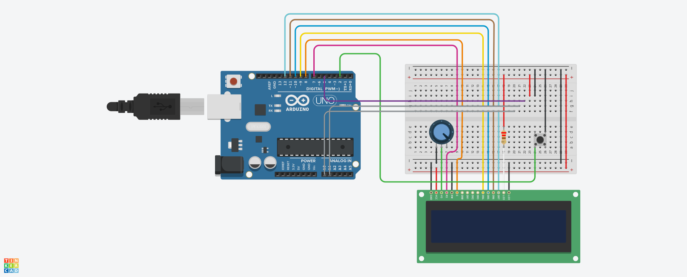

# 🐍 Snake Game on Arduino with 20x4 LCD & Joystick

This is a simple Snake game implemented using an Arduino Uno, a 20x4 character LCD (JHD204A), and a joystick. The game includes a start screen, live gameplay with apple spawning, and screen wrapping logic to continue from the opposite edge.

---

## 🧰 Hardware Required

| Component             | Quantity |
|----------------------|----------|
| Arduino Uno (or Nano)| 1        |
| JHD204A 20x4 LCD     | 1        |
| Potentiometer (10kΩ) | 1        |
| Joystick module      | 1        |
| Pushbutton (optional)| 1        |
| Resistors (220Ω/10kΩ as needed) | - |
| Breadboard + jumper wires | 1 set  |

---

## 🔌 Wiring Diagram

## ⚙️ Connections

### LCD Pin Map (16-pin Header)

| LCD Pin | Function      | Arduino Pin |
|---------|---------------|-------------|
| 1 (VSS) | GND           | GND         |
| 2 (VDD) | +5V           | 5V          |
| 3 (V0)  | Contrast Adj. | Center pin of potentiometer |
| 4 (RS)  | Register Select | D7         |
| 5 (RW)  | Read/Write    | GND         |
| 6 (EN)  | Enable        | D8          |
| 11 (D4) | Data Bit 4    | D9          |
| 12 (D5) | Data Bit 5    | D10         |
| 13 (D6) | Data Bit 6    | D11         |
| 14 (D7) | Data Bit 7    | D12         |
| 15 (A)  | Backlight +   | 5V (or via resistor) |
| 16 (K)  | Backlight -   | GND         |

> 💡 Note: If your JHD204A LCD has **dual rows of pins**, only connect one row to your Arduino. Avoid connecting both rows or you'll short the pins and damage the board.

---

### Joystick Connections

| Joystick Pin | Arduino Pin |
|--------------|-------------|
| GND          | GND         |
| VCC          | 5V          |
| VRx          | A0          |
| VRy          | A1          |
| SW (Button)  | D2          |

---

## 🧩 Software Setup

1. **Install the Arduino IDE**
   - [Download Arduino IDE](https://www.arduino.cc/en/software)

2. **Install Required Library**
   - Go to **Sketch > Include Library > Manage Libraries**
   - Search for `LiquidCrystal` and install it (should already be included with the IDE)

3. **Upload the Code**
   - Connect your Arduino to your PC
   - Select the correct **board** and **COM port**
   - Upload the provided `.ino` file

---

## 🎮 Game Controls

- Use the **joystick** to control the direction:
  - Left, Right, Up, Down
- Press the **external button** to:
  - Start the game
  - Restart after Game Over

---

## 📝 To-Do (Optional)

- [ ] Add scoring system  
- [ ] Add level/speed increase  
- [ ] Add sound effects (buzzer)  
- [ ] Add smoother animation with custom LCD characters  

---

## 📜 License

This project is open-source and available under the [MIT License](https://opensource.org/licenses/MIT).

---

## 🙌 Credits

Developed by [Your Name Here]  
Inspired by classic retro Snake games
